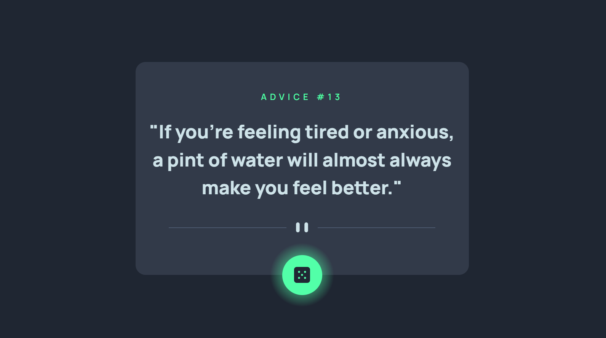

# Frontend Mentor - Advice generator app solution

This is a solution to the [Advice generator app challenge on Frontend Mentor](https://www.frontendmentor.io/challenges/advice-generator-app-QdUG-13db). Frontend Mentor challenges help you improve your coding skills by building realistic projects.

## Table of contents

- [Overview](#overview)
  - [The challenge](#the-challenge)
  - [Screenshot](#screenshot)
  - [Links](#links)
- [My process](#my-process)
  - [Built with](#built-with)
  - [What I learned](#what-i-learned)
  - [Continued development](#continued-development)
- [Author](#author)

**Note: Delete this note and update the table of contents based on what sections you keep.**

## Overview

### The challenge

Users should be able to:

- View the optimal layout for the app depending on their device's screen size
- See hover states for all interactive elements on the page
- Generate a new piece of advice by clicking the dice icon

### Screenshot



### Links

- Solution URL: [Github Repo](https://github.com/FelipeGuerra5/Advice-Api-Component)
- Live Site URL: [GitHub Pages](https://felipeguerra5.github.io/Advice-Api-Component/)

## My process

### Built with

- Mobile-first workflow
- [React](https://vitejs.dev/) - JS Framework
- [ViteJS](https://reactjs.org/) - JS Front-end Tooling
- [Styled Components](https://styled-components.com/) - For styles
- Styles as a module

### What I learned

- Hot to send a ViteJS project in ReactJS to the github pages.

  1. Go to Vite.config file and add: `base: "/<Name-of-Repo"` 
  2. Build the project with `npm run build` 
  3. Add the dist dir to the git tracked files:
    `git add dist -f`
  4. Then push to gh-pages branch with:
    `git subtree push --prefix dist origin gh-pages`
  5. After that the GitHub page will be rendere on top of the dist directory on branch gh-pages leaving the mainn branch to see the unbuildeed project.

- Change images with no manipulation on the HTML.
  1. Name the css stylesheet as file.module.css
  2. Import it on the jsx file 
    ```JS
    import styles from "./file.module.css"

    function App () {
      <Card className={style.card}>
    }
    ``` 
    - That is important for dont matter the cumber of components you use with the same class they wont get mixed for they each receive an unique class.

    - Also in the css file you can use:
  ```css
  <!-- image for Desktop -->
  .divisorSvg {
    width: 400px;
    content:url("./assets/pattern-divider-desktop.svg")
  }

  <!--  Image for Mobile -->
  @media screen and (max-width: 375px) and (orientation: portrait) {
       .divisorSvg {
        width: 300px;
        content:url("./assets/pattern-divider-mobile.svg")
    }
  }
  ```
    - So wen the classes change name you could handle the image change without the HTML.

- Liked to insert the ID for the advice in the Localstorage, so the user does not have to go throght all the advices to reach the last one.

### Continued development

A future improvment would be to insert the id for each advice in the route, besides the LocalStorage. as: `http://<Domain>/?id=2`


### Useful resources


## Author

- LinkedIn - [Felipe Baldim Guerra](https://www.linkedin.com/in/felipe-baldim-guerra-858556127/)
- Frontend Mentor - [@FelipeGuerra5](https://www.frontendmentor.io/profile/FelipeGuerra5)

